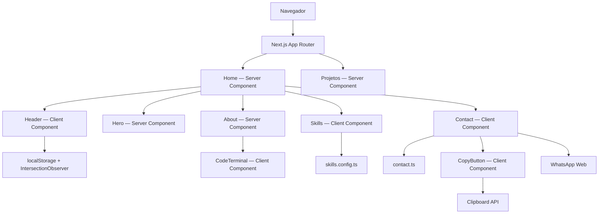

# Descomplica Dev Dan — Portfólio

Portfólio profissional construído com Next.js e React para apresentar experiência, competências técnicas e projetos de **Descomplica Dev Dan**, desenvolvedor web e analista de sistemas.

O produto combina uma identidade visual inspirada em terminais com uma arquitetura orientada a componentes, geração estática, responsividade, acessibilidade e uma estratégia automatizada de qualidade.

> **Status do produto:** em desenvolvimento ativo. A Home, as seções Sobre, Skills e Contato e a primeira versão da página Projetos estão implementadas. Experiências, Footer e os cases definitivos permanecem no roadmap.

## Visão executiva

| Item | Estado atual |
| --- | --- |
| Framework | Next.js 16.3.4 com App Router |
| Interface | React 19.2.8 + TypeScript 5 |
| Renderização | Server Components por padrão e rotas estáticas |
| Estilização | CSS Modules, tokens globais e CSS responsivo |
| Testes | Vitest, React Testing Library, Playwright e axe-core |
| Cobertura | 84,44% de linhas e 75,80% de branches na última execução registrada |
| Qualidade | ESLint, TypeScript, build e testes automatizados |
| Segurança | 0 vulnerabilidades conhecidas no último `npm audit` |
| Integração contínua | GitHub Actions com relatórios e evidências |

## Objetivo do produto

O projeto centraliza a presença profissional de Danilo em uma experiência própria, rápida e acessível. Além de apresentar informações profissionais, o repositório demonstra decisões de engenharia relevantes para aplicações modernas:

- separação entre componentes de servidor e componentes interativos;
- baixo acoplamento entre conteúdo, apresentação e comportamento;
- animações com alternativa para movimento reduzido;
- testes em diferentes níveis da pirâmide;
- critérios objetivos de qualidade e cobertura;
- rastreabilidade de defeitos conhecidos;
- pipeline automatizado para evitar regressões.

## Funcionalidades

### Implementadas

- Header responsivo com navegação por rota e âncoras.
- Identificação automática da seção visível.
- Menu móvel com bloqueio de rolagem do documento.
- Preferência de tema persistida em `localStorage`.
- Hero responsivo com arte personalizada e animação sequencial.
- CTAs para projetos e apresentação profissional.
- Indicadores de atuação, links para GitHub e LinkedIn, acesso ao WhatsApp e cópia direta de e-mail e telefone.
- Formulário de contato que gera uma conversa de WhatsApp com os dados preenchidos.
- Feedback acessível após ações de cópia para a área de transferência.
- Seção Sobre com especialidades e terminal animado.
- Realce de sintaxe sem dependência externa.
- Seção Skills orientada por configuração.
- Efeitos visuais controlados por CSS e posição do ponteiro.
- Página `/projetos` pré-renderizada com estrutura para cases.
- Suporte a `prefers-reduced-motion`.

### Em evolução

- Projetos ainda usam conteúdo demonstrativo.
- Currículo ainda não está disponível para download.
- Seções Experiências e Footer ainda não foram implementadas.
- O tema claro precisa ser propagado de forma consistente para todas as superfícies.

## Arquitetura

O App Router organiza as rotas e mantém componentes como Server Components sempre que não dependem de estado, efeitos ou APIs do navegador. Os limites `"use client"` ficam restritos às interações do Header, do terminal animado, da seção Skills, do formulário de contato e da cópia para a área de transferência.



### Estrutura do repositório

```text
.
├── .github/
│   └── workflows/
│       └── quality.yml
├── docs/
│   ├── auditoria-e-testes.md
│   └── resultado-da-suite.md
├── public/
│   └── assets/
├── src/
│   ├── app/
│   │   ├── projetos/
│   │   ├── globals.css
│   │   ├── layout.tsx
│   │   └── page.tsx
│   ├── components/
│   │   ├── About/
│   │   ├── Contact/
│   │   ├── CopyButton/
│   │   ├── Header/
│   │   ├── Hero/
│   │   └── Skills/
│   └── config/
│       └── contact.ts
├── tests/
│   └── e2e/
├── playwright.config.ts
├── vitest.config.mts
└── vitest.setup.ts
```

## Decisões técnicas

| Decisão | Motivação | Consequência |
| --- | --- | --- |
| App Router | Usar o modelo atual do Next.js e permitir renderização no servidor | Menor JavaScript enviado ao cliente |
| Server Components por padrão | Evitar hidratação onde não existe interação | Melhor custo de carregamento e limites explícitos |
| CSS Modules | Isolar estilos sem introduzir runtime adicional | Estilos previsíveis e próximos aos componentes |
| Animações em CSS | Reduzir dependências e manter controle fino | Menor bundle e suporte direto a movimento reduzido |
| Skills orientada por dados | Centralizar nome, ícone e classe de cada tecnologia | Inclusão de novas skills sem duplicar marcação |
| Propriedades CSS para ponteiro | Evitar estado React em eventos de alta frequência | Menos renderizações durante a interação |
| Dados de contato centralizados | Manter e-mail, telefone e perfis em uma única fonte | Alterações de canais sem duplicação entre Hero e Contato |
| WhatsApp como destino do formulário | Disponibilizar contato funcional sem depender de um backend ou serviço externo | A mensagem é montada no navegador e confirmada pelo visitante no WhatsApp |
| Componente reutilizável de cópia | Padronizar Clipboard API, fallback e feedback acessível | E-mail e telefone podem ser copiados sem abrir outro aplicativo |
| Vitest + Testing Library | Testar comportamento e semântica dos componentes | Feedback rápido e testes menos acoplados |
| Playwright + axe-core | Validar fluxos e acessibilidade no navegador real | Cobertura de integração próxima do uso real |
| Falhas esperadas rastreadas | Manter defeitos conhecidos visíveis sem tornar a suíte instável | Correções futuras já possuem especificação de regressão |

## Stack técnica

### Produto

- Next.js 16.3.4
- React 19.2.8
- TypeScript 5
- CSS Modules
- `next/font`
- `next/image`
- React Icons

### Qualidade

- ESLint 9
- Vitest 4
- React Testing Library
- Testing Library User Event
- Playwright 1.62
- axe-core para verificações WCAG automatizáveis
- V8 Coverage
- GitHub Actions

O Tailwind CSS está instalado como parte da configuração inicial, mas a interface atual utiliza CSS Modules. A permanência dessa dependência deve ser reavaliada antes da versão estável.

## Estratégia de testes

A suíte prioriza comportamento observável e utiliza cada ferramenta no nível em que ela oferece mais valor.

| Camada | Escopo | Exemplos |
| --- | --- | --- |
| Unidade e componente | Renderização, semântica e interações isoladas | Header, Hero, About, Contact, CopyButton, CodeTerminal e Skills |
| Integração | Composição das páginas e contratos entre componentes | Home e Projetos |
| E2E | Jornadas executadas no navegador | Navegação, rota de projetos e persistência do tema |
| Acessibilidade | Regras WCAG automatizáveis | Home e Projetos com axe-core |
| Qualidade estática | Tipos, padrões e problemas de código | TypeScript e ESLint |
| Build | Compatibilidade com produção e pré-renderização | `/` e `/projetos` |

### Resultado da execução de referência

| Métrica | Resultado |
| --- | ---: |
| Arquivos de teste Vitest | 9 |
| Testes de unidade/componente | 16 aprovados |
| Cenários Playwright | 8 concluídos |
| Cobertura de linhas | 84,44% |
| Cobertura de statements | 82,35% |
| Cobertura de funções | 87,71% |
| Cobertura de branches | 75,80% |

Três cenários E2E representam defeitos conhecidos e estão marcados com `test.fail()`. Eles são executados como falhas esperadas e devem ser convertidos em testes de regressão obrigatórios assim que os respectivos problemas forem corrigidos. O cenário dos canais sociais já foi convertido em regressão obrigatória.

Consulte os documentos completos:

- [Auditoria técnica e estratégia de testes](docs/auditoria-e-testes.md)
- [Resultado da suíte de qualidade](docs/resultado-da-suite.md)

## Quality gates

Uma alteração está pronta para integração quando atende aos seguintes critérios:

1. ESLint sem erros.
2. TypeScript sem erros.
3. Testes de unidade e componentes aprovados.
4. Cobertura mínima de 70% para linhas, statements e funções.
5. Cobertura mínima de 60% para branches.
6. Fluxos E2E e acessibilidade concluídos.
7. Build de produção aprovado.
8. Nenhuma vulnerabilidade conhecida de severidade relevante introduzida.

O comando abaixo concentra essas verificações:

```bash
npm run check
```

## Execução local

### Pré-requisitos

- Node.js 20 ou superior.
- npm 10 ou superior.
- Git.

### Instalação

```bash
git clone <URL_DO_REPOSITORIO>
cd portfolio-descomplicadevdan
npm ci
```

### Desenvolvimento

```bash
npm run dev
```

A aplicação ficará disponível em [http://localhost:3000](http://localhost:3000).

### Preparação dos testes E2E

Na primeira execução, instale o navegador controlado pelo Playwright:

```bash
npx playwright install chromium
```

Em Linux ou em um agente de CI, também podem ser necessárias as dependências do sistema:

```bash
npx playwright install --with-deps chromium
```

## Scripts disponíveis

| Comando | Responsabilidade |
| --- | --- |
| `npm run dev` | Inicia o ambiente de desenvolvimento |
| `npm run build` | Gera o build de produção |
| `npm run start` | Executa o build de produção |
| `npm run lint` | Executa a análise do ESLint |
| `npm run typecheck` | Gera os tipos de rotas do Next.js e valida o TypeScript sem emitir JavaScript |
| `npm test` | Executa Vitest uma vez |
| `npm run test:watch` | Executa Vitest em modo contínuo |
| `npm run test:coverage` | Executa os testes e gera cobertura HTML/JSON |
| `npm run test:e2e` | Executa Playwright no Chromium |
| `npm run test:e2e:ui` | Abre a interface interativa do Playwright |
| `npm run test:all` | Executa cobertura e testes E2E |
| `npm run check` | Executa todos os quality gates locais |

## Relatórios e evidências

Os artefatos são gerados localmente e não são versionados:

| Artefato | Local |
| --- | --- |
| Cobertura HTML | `coverage/index.html` |
| Relatório Playwright | `playwright-report/index.html` |
| Resultado Playwright em JSON | `reports/playwright-results.json` |
| Screenshots, vídeos e traces | `test-results/artifacts/` |

No GitHub Actions, esses relatórios são publicados como artefatos por 14 dias, inclusive quando uma etapa falha.

## Integração contínua

O workflow `.github/workflows/quality.yml` é executado em pushes para `main` e em pull requests. O pipeline realiza:

1. instalação determinística com `npm ci`;
2. lint;
3. verificação de tipos;
4. testes com cobertura;
5. build de produção;
6. instalação do Chromium;
7. testes E2E e acessibilidade;
8. publicação dos relatórios.

## Acessibilidade

O projeto inclui:

- estrutura semântica e hierarquia de títulos;
- nomes acessíveis para controles e links;
- confirmação acessível para ações de cópia;
- foco visível para navegação por teclado;
- conteúdo decorativo oculto de tecnologias assistivas;
- nome completo disponível para leitores de tela durante a animação;
- suporte a `prefers-reduced-motion`;
- verificações automatizadas com axe-core.

Testes automatizados identificam apenas parte das barreiras. Navegação por teclado, leitores de tela, contraste contextual e experiência com zoom devem continuar fazendo parte da validação manual.

## Segurança e dependências

O último `npm audit` terminou sem vulnerabilidades conhecidas. O Lighthouse CI chegou a ser avaliado, mas não foi mantido porque sua árvore de dependências introduziu 13 vulnerabilidades transitivas, incluindo 7 de severidade alta.

Essa decisão mantém o projeto seguro enquanto métricas de desempenho podem ser executadas de forma isolada. A adoção do Lighthouse CI poderá ser reconsiderada quando a cadeia afetada for atualizada.

## Limitações e dívida técnica conhecida

| Prioridade | Item | Estado |
| --- | --- | --- |
| Alta | Corrigir o corte de “Descomplica” em 390 px | Rastreado por E2E |
| Alta | Implementar ou remover o link para Experiências | Rastreado por E2E |
| Média | Corrigir o contrato ARIA do terminal | Rastreado por E2E |
| Média | Completar o tema claro | Pendente |
| Média | Melhorar foco e fechamento por `Escape` no menu móvel | Pendente |
| Média | Tornar o build independente da rede do Google Fonts | Pendente |
| Média | Substituir projetos demonstrativos por cases reais | Pendente |
| Baixa | Remover assets órfãos e otimizar a imagem do Hero | Pendente |

## Roadmap

- [x] Estruturar o projeto com Next.js, React e TypeScript.
- [x] Implementar Header, Hero, Sobre, Skills e Projetos.
- [x] Implementar Contato com GitHub, LinkedIn, WhatsApp e cópia de dados.
- [x] Direcionar o formulário preenchido para uma conversa no WhatsApp.
- [x] Aplicar responsividade e suporte a movimento reduzido.
- [x] Configurar testes de unidade, integração, E2E e acessibilidade.
- [x] Definir limites mínimos de cobertura.
- [x] Configurar pipeline de qualidade no GitHub Actions.
- [x] Documentar auditoria, resultados e dívida técnica.
- [ ] Corrigir os defeitos conhecidos protegidos por testes.
- [ ] Disponibilizar o currículo para download.
- [ ] Publicar projetos e cases reais.
- [ ] Criar as seções Experiências e Footer.
- [ ] Adicionar Open Graph, sitemap e robots.
- [ ] Executar auditoria manual completa de acessibilidade.
- [ ] Estabelecer orçamento de performance.
- [ ] Publicar a aplicação.

## Convenções

Commits seguem o padrão Conventional Commits:

```text
feat: adiciona uma nova capacidade
fix: corrige comportamento incorreto
test: adiciona ou ajusta cobertura automatizada
docs: atualiza documentação
refactor: melhora a estrutura sem alterar comportamento
chore: atualiza ferramentas ou manutenção interna
```

Branches de trabalho devem ser curtas, focadas e integradas por pull request. Mudanças funcionais devem incluir testes ou uma justificativa registrada para a ausência deles.

## Ambiente em OneDrive

O repositório está em uma pasta sincronizada pelo OneDrive. Arquivos gerados em `.next`, `next-env.d.ts` ou metadados internos do Git podem ocasionalmente receber bloqueios e causar erros `EPERM`.

Caso isso se torne recorrente, mantenha o clone de desenvolvimento em uma pasta local fora do OneDrive e utilize o repositório remoto como mecanismo de sincronização.

## Autoria

Desenvolvido por **Descomplica Dev Dan**.

Canais profissionais disponíveis na interface: GitHub, LinkedIn, WhatsApp e e-mail.
